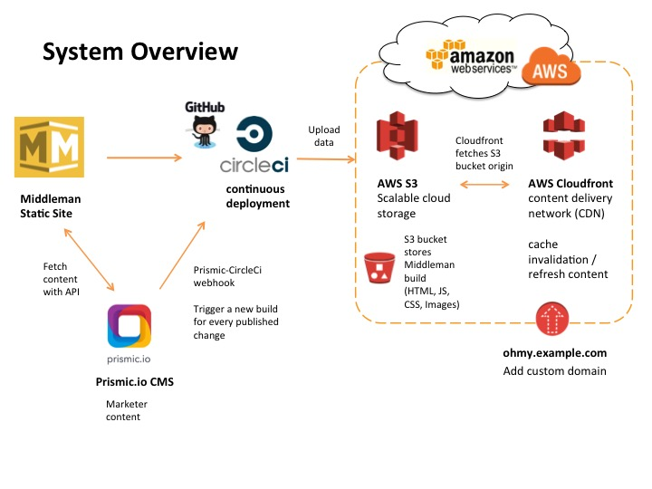
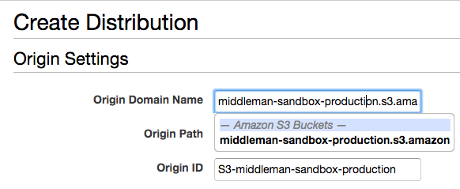

Middleman AWS Prismic CircleCi
=================
Welcome to our Middleman-AWS-Prismic-CircleCi open source project!
We've used this strudy setup to create high-traffic crowdfunding sites and other static sites at [Monsoon](http://www.monsoonco.com/)
(e.g.
[LunaSleep](http://lunasleep.com/),
[Swypcard](https://www.swypcard.com/),
[San Francisco Exploratorium](http://www.exploratorium.edu/annual-report-2014/) and
[Fove](http://www.getfove.com/)
)
The following provides step-by-step instructions for generating a static site with Middleman, Amazon Web Services, CircleCI and Prismic.

## Ingredients
* [Middleman](https://middlemanapp.com/)
* Middleman gems [Middleman S3 Sync](https://github.com/fredjean/middleman-s3_sync) and [Middleman Cloudfront](https://github.com/andrusha/middleman-cloudfront)
* [AWS S3](http://aws.amazon.com/s3/) and [AWS Cloudfront](http://aws.amazon.com/cloudfront/)
* [CircleCI](https://circleci.com/) as a continuous integration platform for deployment to AWS and for automated testing
* [Prismic](https://prismic.io/) for Content Management

## Table of Contents
1. [Running the local web server](#web_server)
2. [Create a new Middleman Site](#new_middleman_project)
3. [Get AWS access keys and Attach a Policy in AWS Identity & Access Management (IAM)](#aws_iam)
4. [Setup an AWS S3 Bucket](#aws_s3)
5. [Create an AWS Cloudfront Distribution](#aws_cloudfront)
6. [Add Middleman s3 sync gem with configuration](#aws_middleman_s3_gem)
7. [Add Middleman cloudfront gem with configuration](#aws_middleman_cloudfront_gem)
8. [Pushing assets to AWS from your console as a first test](#aws_local_test)
9. [CircleCI for testing and continuous deployment](#circleci)
10. [Set Environmental Variables in CircleCi](#circleci_vars)
11. [Prismic Content Management](#prismic)
12. Launch Day in AWS

 1. Running the local web server
-------------

If you're pulling down this repo and want to get it running, do the following:

1. **Bundle Gems**

   <code> bundle install </code>

2. **Compile files**

   <code> bundle exec middleman build </code>

3. **Start a local web server running at: http://localhost:4567/**

   <code> bundle exec middleman </code>

 2. Create a new Middleman site
-------------

1. Follow steps to [install Middleman](https://middlemanapp.com/basics/install/) and [start a new site](https://middlemanapp.com/basics/start_new_site/)

 3. Grab AWS access keys and Attach a Policy in AWS Identity & Access Management (IAM)
-------------

1. After an AWS account has been setup, go to AWS IAM

 4. Setup an AWS S3 Bucket
-------------

1. **Create an AWS S3 Bucket**

   Go to Services > S3.  Create a Bucket in S3, add a meaningful name (e.g. myappname-production)
   and region option, e.g. Northern California).

   Once you choose a region, search region codes here:
   http://www.bucketexplorer.com/documentation/amazon-s3--amazon-s3-buckets-and-regions.html

   You will need to add your region property in **config.rb** in the [Setup an AWS S3 Bucket](#aws_s3) step.

   

2. **Enable Static Website Hosting**

    Go to your bucket and click **Properties**.  Under **Static Website Hosting**, click **Enable website hosting**
    and add **index.html** in Index Document and **error.html** in Error Document. **Save.**

    

3. **Add CORS Configuration** for loading fonts from an origin other than your web application (e.g. Font Awesome).

    

**More on this**

  * [Working with Amazon S3 Buckets](http://docs.aws.amazon.com/AmazonS3/latest/dev/UsingBucket.html)

 5. Create an AWS Cloudfront Distribution
-------------

1. **Create an AWS Cloudfront Distribution**

    Go to Services > Cloudfront

2. Select "Web" as your delivery method:

  

3. **Create Distribution**

  * Add your S3 bucket name to the **Origin Domain Name** field.
  If you click on the field, a list will automatically appear.
  It should also autofill your Origin ID.  (e.g. example-bucket)

    

  * **DELETE Origin Domain Name**. Delete the autofilled Origin Domain Name
  (e.g. middleman-sandbox-production.s3.amazonaws.com).
  Replace this with the associated S3 Bucket Static Website Endpoint
  (e.g. middleman-sandbox-production.s3-website-us-west-1.amazonaws.com).
  This is important so your Cloudfront Url matches the static website endpoint in S3.

    

  * Under **Default Cache Behavior Settings**, click on the **Forward Headers** options list.  Click Whitelist Headers. Add Origin

  * Under **Distribution Settings**, add 'index.html' to the **Default Root Object**.

  * Click **Create Distribution**

4. You’ll be brought to a CloudFront Distributions page in which a Cloudfront domain name will be returned to you.
  (e.g. http://dXXXXXXXXXXX.cloudfront.net/)

  

**More on this:**

  * [Getting Started with CloudFront](http://docs.aws.amazon.com/AmazonCloudFront/latest/DeveloperGuide/GettingStarted.html).

 6. Add middleman s3 sync gem with configuration
-------------

Use middeman-s3_sync gem to push assets to your AWS s3 bucket.

Add [middleman-s3_sync gem](https://github.com/fredjean/middleman-s3_sync) in your Gemfile and follow configuration instructions.  See [config.rb](https://github.com/monsoonco/Middleman-AWS-Prismic-CircleCi/blob/master/config.rb).

 7. Add middleman cloudfront gem with configuration
-------------

We're using middleman-cloudfront for AWS CloudFront cache invalidation.

Add [middleman-cloudfront gem](https://github.com/andrusha/middleman-cloudfront) and follow configuration instructions.  See [config.rb](https://github.com/monsoonco/Middleman-AWS-Prismic-CircleCi/blob/master/config.rb).

You can watch invalidations processing if you go to CloudFront Distributions > Click on Cloudfront distribution ID > Invalidations tab

 8. Pushing assets to AWS from your console as a first test
-------------

If you need to experiment with pushing assets to AWS S3 locally, you can do the following:

   * Create an aws.yml file at the root of the application.
   * Add environmental variables from AWS LastPass notes to aws.yml
   * Uncomment  <code> ENV = YAML::load(File.open('aws.yml')) </code> in [config.rb](https://github.com/monsoonco/Middleman-AWS-Prismic-CircleCi/blob/master/config.rb)

   <pre><code>

      AWS_S3_BUCKET_NAME: ''
      AWS_REGION: ''
      AWS_ACCESS_KEY_ID: ''
      AWS_SECRET_KEY: ''
      STAGING_CLOUDFRONT_DISTRIBUTION_ID: ''
      PRODUCTION_CLOUD_DISTRIBUTION_ID: ''

    </code></pre>

   * Run these commands to push assets to AWS middleman-sandbox-staging bucket

   <code> bundle exec middleman build --verbose </code>

   <code> bundle exec middleman s3_sync --bucket=your-aws-bucket-name </code>

   <code> PRODUCTION_CLOUDFRONT_DISTRIBUTION_ID=XXXXXXXXXXX bundle exec middleman invalidate </code>

 9. CircleCI for testing and continuous deployment
-------------

1. Setup your Github account with [CircleCi](https://circleci.com/).
2. In CircleCi, add your project/repo.
3. Add environmental variables for each respective project.  Go to your project, click the gear icon in upper right hand corner, Tweaks > Environmental variables.
   Add AWS_S3_BUCKET_NAME, AWS_REGION, AWS_ACCESS_KEY_ID, AWS_SECRET_KEY, and PRODUCTION_CLOUD_DISTRIBUTION_ID.
4. Create a [circle.yml]() file in the root of your repo.

<pre><code>

  dependencies:
    pre:
      - bundle install

  deployment:
    production:
      branch: master
      commands:
        - bundle exec middleman build --verbose

        # Push Middleman build to your AWS S3 bucket
        - bundle exec middleman s3_sync --bucket=middleman-sandbox-production

        # Invalidate cache in AWS Cloudfront
        - PRODUCTION_CLOUDFRONT_DISTRIBUTION_ID= bundle exec middleman invalidate

</code></pre>

 10. Prismic Content Management and Adding a Webhook with CircleCi
-------------

1. Follow instructions in [Prismic](https://prismic.io/) to create a Document Mask and create content.

2. In this example, we're using ruby to add Prismic Content to view.  See [config.rb](https://github.com/monsoonco/Middleman-AWS-Prismic-CircleCi/blob/master/config.rb) as an example.

3. Go to your prismic account.  Settings > Webhooks.

4. Go to CircleCi and create an API token (Settings > API Tokens  in CircleCi). Create a token for the prismic webhook.

4. Add a POST request url from CircleCI to trigger a build in CircleCi everytime someone updates content in Prismic. CircleCi enables you to trigger a build with the following params:

  **https://circleci.com/api/v1/project/:username/:project/tree/:branch?circle-token=:token**

  Documentation resources for creating a webhook:

  * [Introducing prismic.io webhooks: integration with publishing and changes events](https://blog.prismic.io/U4SxWjAAAC8AQ1-W/introducing-prismicio-webhooks-integration-with-publishing-and-changes-events)
  * [Prismic Webhooks](https://developers.prismic.io/documentation/UjBeuLGIJ3EKtgBV/repository-administrators-manual#webhooks)
  * [CircleCi: Trigger a new build](https://circleci.com/docs/api#new-build)

